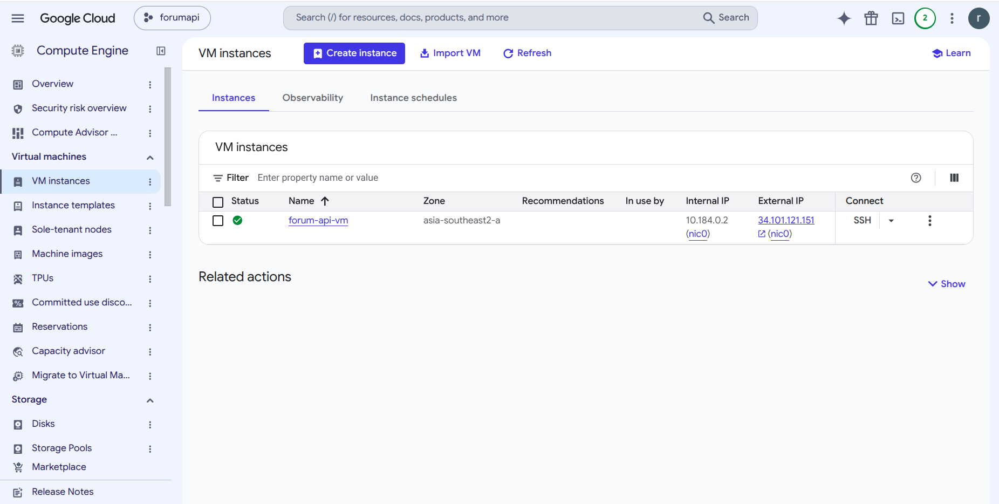
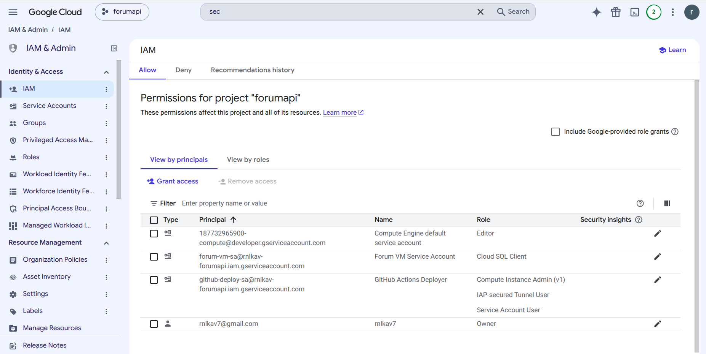
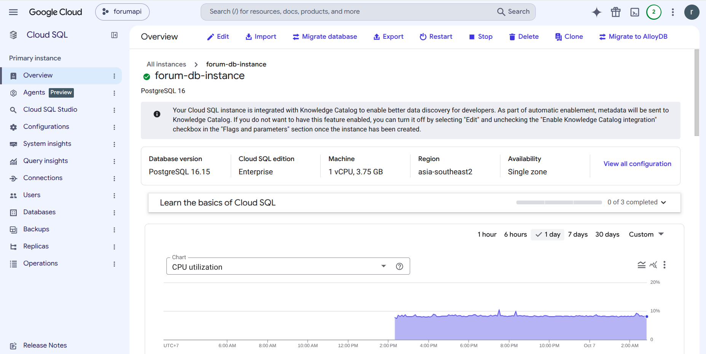
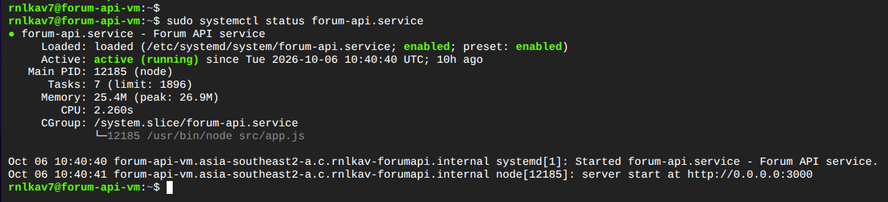
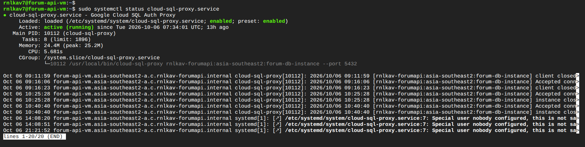
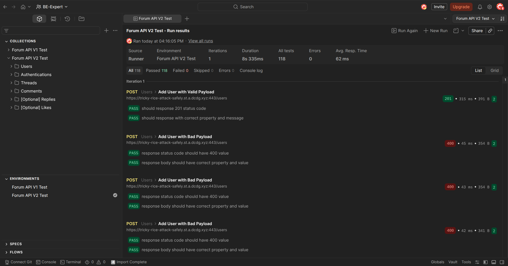
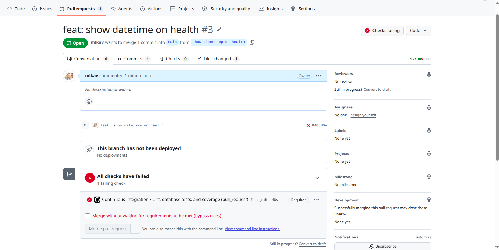
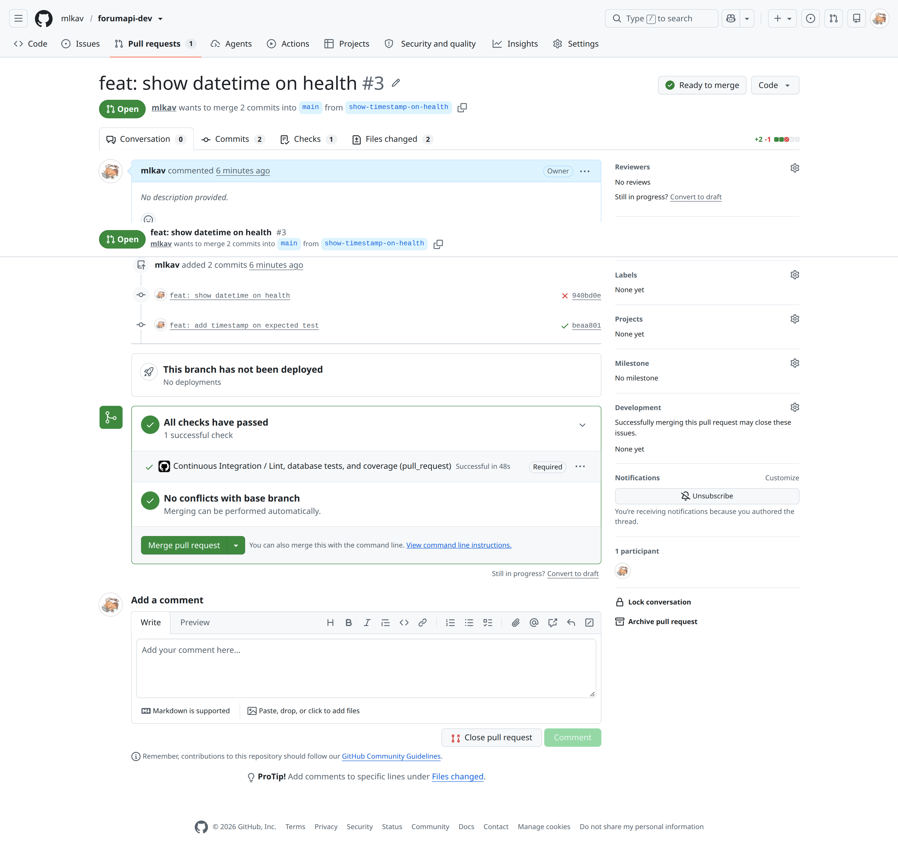

# Forum API V2

Forum API provides authentication, threads, comments, replies, soft deletion, and comment like toggling. The project uses Node.js 22, Express, PostgreSQL, and Clean Architecture.

> URL Forum API: https://tricky-rice-attack-safely.st.a.dcdg.xyz/health

> URL github: https://github.com/mlkav/forumapi-dev/actions

## Run locally

Use Node.js 22, npm, and PostgreSQL to run the project.

```bash
npm ci
cp .env.example .env
```

Set the local database connection and distinct JWT secrets in `.env`. Create development and `forumapi_test` databases, then create `config/database/test.json` with credentials dedicated to the `forumapi_test` database.

Run the migrations and start the server:

```bash
npm run create-db:prod
npm run migrate -- up
npm run start:dev
```

The server listens on `http://localhost:3000` by default. Use these commands to run test migrations, tests, coverage, and lint:

```bash
npm run create-db:test
npm run migrate:test -- up
npm test
npm run test:coverage
npm run lint
npm run format:check
```

## Endpoints

| Method | Path | Description |
| --- | --- | --- |
| `GET` | `/health` | Health check |
| `POST` | `/users` | Register a user |
| `POST`, `PUT`, `DELETE` | `/authentications` | Log in, refresh a token, and log out |
| `POST` | `/threads` | Create a thread (authentication required) |
| `GET` | `/threads/{threadId}` | Get thread details, comments, replies, and like counts |
| `POST` | `/threads/{threadId}/comments` | Add a comment (authentication required) |
| `DELETE` | `/threads/{threadId}/comments/{commentId}` | Delete the user's own comment |
| `PUT` | `/threads/{threadId}/comments/{commentId}/likes` | Toggle a like (authentication required) |
| `POST` | `/threads/{threadId}/comments/{commentId}/replies` | Add a reply (authentication required) |
| `DELETE` | `/threads/{threadId}/comments/{commentId}/replies/{replyId}` | Delete the user's own reply |


## Deploy to GCP

The deployment uses Compute Engine with Ubuntu, Cloud SQL for PostgreSQL, Cloud SQL Auth Proxy, and systemd. Run `gcloud` commands from Cloud Shell or a computer with the Google Cloud CLI, access to the project, and `openssl`— not from the application VM.

### Set up the project and VM

1. Set `PROJECT_ID`, `GITHUB_REPO`, `REGION`, and `ZONE` near the top of [`setup-gcp.sh`](./setup-gcp.sh). The script uses these hard-coded values to create GCP resources that may incur charges. Run it with an account that can enable APIs, create Cloud SQL instances and VMs, and manage IAM.
    > This file is not included to avoid plagiarism.

   ```bash
   gcloud auth login
   bash ./setup-gcp.sh
   ```
2. Register the VM's public IP to obtain a Dicoding domain. Replace the `IP Public VM` with This filethe VM's IP, then run this command from a computer with `curl`:

   ```bash
   curl -X POST -H "Content-type: application/json" \
     -d '{ "ip": "[IP Public VM]" }' \
     "https://subdomain-creation-api.dicoding.dev/dns/records"
   ```

   Use the domain returned by the API and make sure both the domain and its `www` subdomain point to the VM's IP. Update `server_name` in [`nginx.conf`](./nginx.conf), install the NGINX configuration, open ports 80 and 443, and start NGINX. After DNS propagation, issue a certificate and configure NGINX with Certbot:

   ```bash
   sudo certbot --nginx \
     -d tricky-rice-attack-safely.st.a.dcdg.xyz \
     -d www.tricky-rice-attack-safely.st.a.dcdg.xyz
   ```

   Replace both example domain names above with the domain returned by the API. Restrict the firewall to required ports; do not expose PostgreSQL or the application port to the internet.

3. Create a GitHub Environment named `production`. Set the `GCP_WIF_PROVIDER` secret and the `GCP_DEPLOY_SERVICE_ACCOUNT`, `GCP_PROJECT_ID`, `GCE_INSTANCE`, `GCE_ZONE`, `GCE_DEPLOY_USER`, and `FORUM_API_HTTPS_URL` variables using the setup output and HTTPS domain. The CD workflow uses these values on pushes to `main` or `master`, and deploys only after lint, migrations, tests, and coverage pass.

### Deploy on the VM

The setup command block performs the initial deployment. For subsequent deployments, Cloud SQL Auth Proxy and the systemd service are running, `/etc/forum-api/forum-api.env` exists, and the VM can fetch the source from GitHub. Then run:

```bash
sudo /opt/forum-api/deploy/deploy-on-vm.sh
```

[`deploy/deploy-on-vm.sh`](./deploy/deploy-on-vm.sh) uses the `main` branch by default. Set `DEPLOY_BRANCH` to deploy another branch. The script installs production dependencies, runs migrations, restarts `forum-api.service`, and checks `http://127.0.0.1:3000/health`.

The CI workflow runs lint, dependency auditing, migrations, tests, and coverage against a temporary PostgreSQL database. The CD workflow runs the same checks before deployment, then performs an HTTPS health check.


## Output:
   
   
   
   
   
   
   
   
